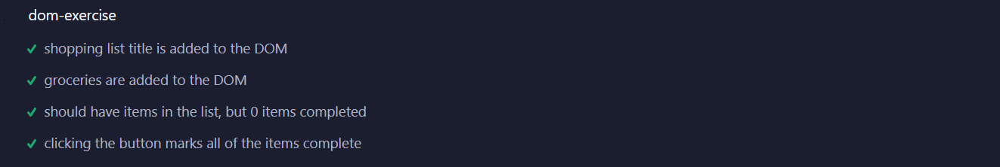

# DOM exercise

In this exercise, you'll build a shopping list from data. You can find all of the code you need to get started in the folder `shopping-list`.

## Exercise

Begin the exercise by starting the shopping list server:

```bash
npm install
npm run server
```

Once the server has been started, open `js/shopping-list.js`. This is the only file you'll modify for this exercise. You must not modify the CSS or HTML files.

The first thing to note in the code is there are several functions declared but left empty. Your job is to fill in these functions.

Following the empty functions is an event listener for `DOMContentLoaded` that runs when the DOM has finished loading. It attaches an event listener to the "Mark All Completed" button to call `markCompleted()` and then calls the `displayShoppingList()` function so that runs immediately.

### Step One: Complete displayShoppingList()

The `displayShoppingList()` function retrieves all the shopping lists from the server. It needs to make an Axios call to `http://localhost:3000/shoppinglists`. Once the server responds, the function then accesses the first (and only) shopping list from the response data and passes it as an argument to the `setShoppingListTitle()` and `displayGroceries()` functions to finish the display.

**Note:** The server has only one shopping list in it's dataset.

### Step Two: Complete setShoppingListTitle()

Use the passed in shopping list's title property to update the element with the id `title` in the DOM.

### Step Three: Complete displayGroceries()

Use the passed in shopping list's array of groceries to update the unordered list of `groceries` in the DOM.

### Step Four: Complete markCompleted()

When you click the button, it calls the method `markCompleted()`. It's your job to make that method work. Get **all** of the list items on the page and add the class `completed` to each one.

## Tests

To test the project and verify completion, you can run the tests using either of the following commands:

* `npm run test` - This runs the tests using the Cypress GUI, which may provide extra help, like screenshots, when troubleshooting a failed test.
* `npm run test-headless` - This runs the tests in "headless" mode to display the results in the console. Tests run significantly faster this way, but you don't get the additional support of the Cypress UI.

> Note: The tests automatically start the server when they run. If you're already running the server in another terminal, you may see an error message like `Error: listen EADDRINUSE: address already in use :::3000`, but the tests do continue to run and perform as expected.

To consider this exercise complete, your shopping list application must do the following:

* When the application loads, it calls the `displayShoppingList()` function
    * This retrieves the shopping lists from the server
* `displayShoppingList()` calls the `setShoppingListTitle()` function
    * This must get a reference to target the id `title` and set it to shopping list's title
* `displayShoppingList()` calls the `displayGroceries()` function
    * You must loop over the array of groceries in the shopping list and create a list item element for each and add it to the DOM
    * TIP: Make sure you target the unordered lists id and not the list itself—be specific
* When the user clicks the `mark-all-complete` button it calls the method `markCompleted()`
    * You must get all of the list items and add the `completed` class to them
    * TIP: An event listener for the button is already created for you


