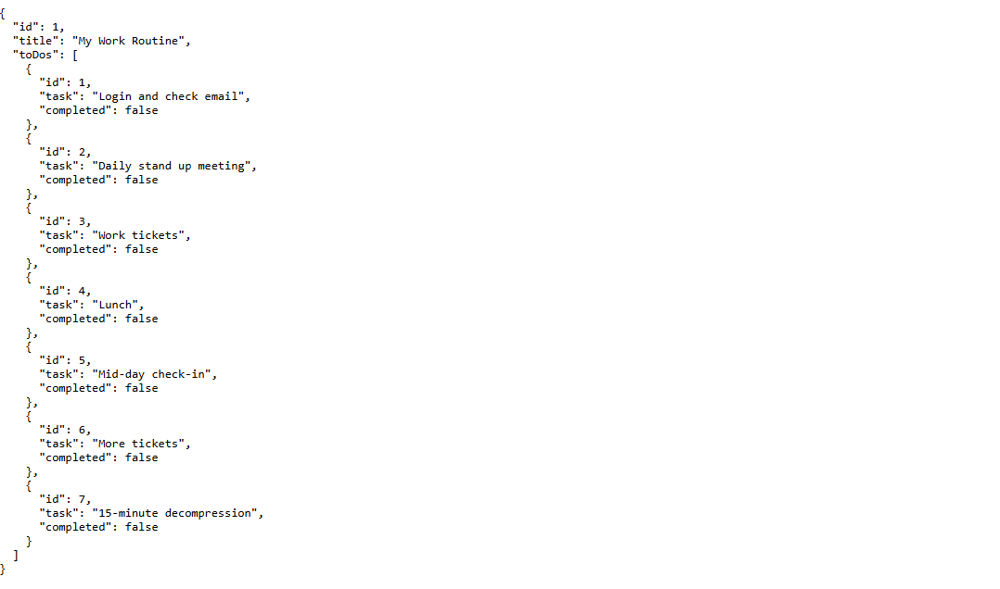
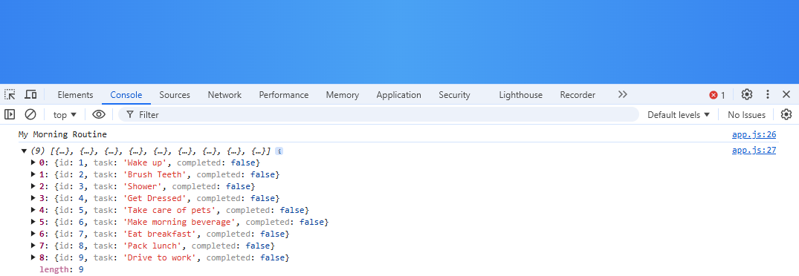
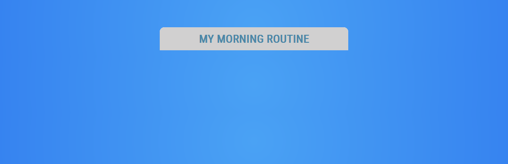
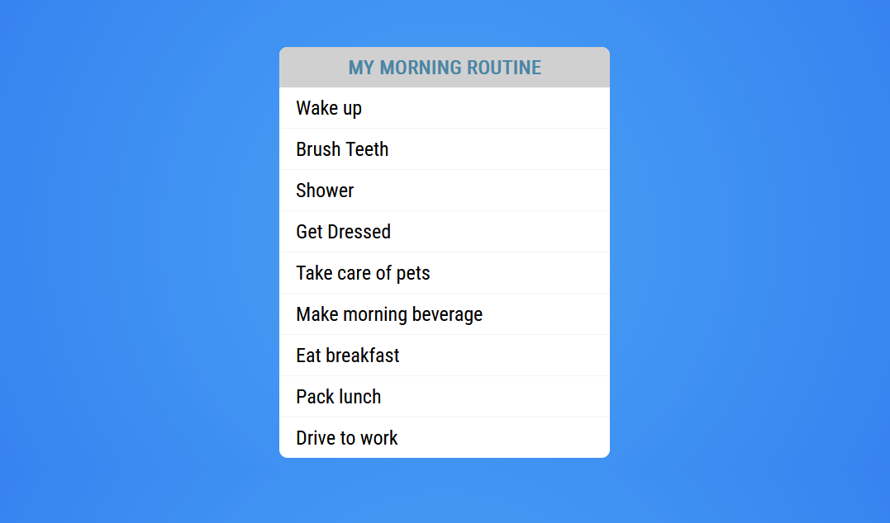
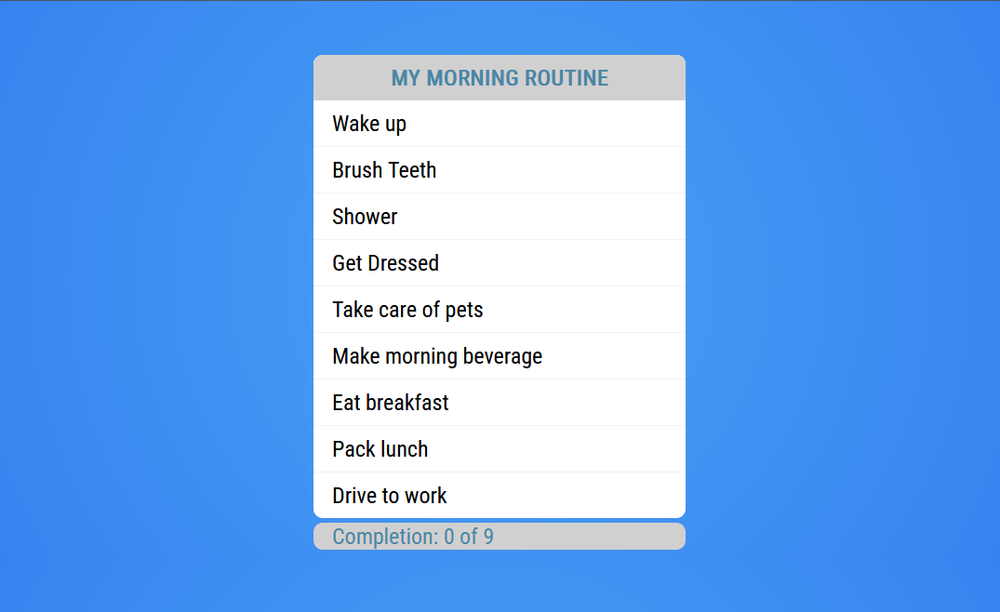
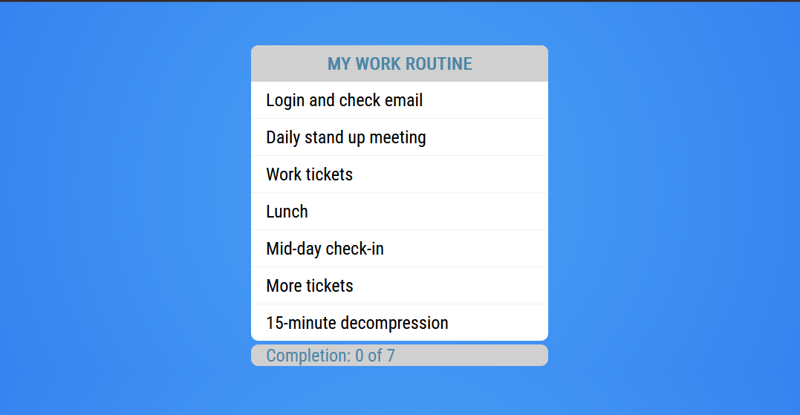

# DOM tutorial

In this tutorial, you'll work on application to manage a person's to-do list. The starting code for this tutorial is in this directory in the folder `todo`. The objective of this project is to get some practice making changes to the DOM.

## Start server

To begin, go to the terminal and start up the to-do server:

```bash
npm install
npm run server
```

You can quickly confirm the server is running by entering `http://localhost:3000/todos` in your browser and see it return the following todo list:



> Note: You may need to select the checkbox for _Pretty-print_ to see the list formatted like the screenshot.

## Todo application

If you take a look at the `index.html` template, you'll notice that there isn't much going on. It loads a CSS file, imports Axios, and has a `div` with the id `todo-panel`:

```html
<html>
<head>
    .
    .
    .
    <!-- Load CSS -->
    <link rel="stylesheet" href="css/main.css">

    <!-- Import Axios (deferred) -->
    <script src='https://cdn.jsdelivr.net/npm/axios@1.7.7/dist/axios.min.js' defer></script>
</head>
<body>
    <main>
        <div id="todo-panel">
            <!-- YOUR CONTENT GOES HERE -->
        </div>
    </main>
    <script src="js/app.js" type="module"></script>
</body>
</html>
```

The `todo-panel` you'll add several more elements: `h1` for a title, `ul` and `li`s for the todo list, and a `label` to track the completion count.

All the work you'll do for this tutorial is in `js/app.js`, so open that now.

### Step One: Create event listener

The first thing you need to do is make sure the DOM is loaded before any of your code is run:

```js
document.addEventListener('DOMContentLoaded', function() {

  // YOUR CODE GOES HERE

});
```

Next, you need to get a reference to the container element, which has the id of `todo-panel`. If you remember from the reading material, it's best to use `getElementById()` if the element has an id:

```js
const todoPanel = document.getElementById('todo-panel');
```

Then, you'll set up a todo list with an `id`, `title` and array of `toDos`:

```js
const todoLists = [
  {
    id: 1,
    title: 'My Morning Routine',
    toDos: [
      { id: 1, task: 'Wake up', completed: false },
      { id: 2, task: 'Brush Teeth', completed: false },
      { id: 3, task: 'Shower', completed: false },
      { id: 4, task: 'Get Dressed', completed: false },
      { id: 5, task: 'Take care of pets', completed: false },
      { id: 6, task: 'Make morning beverage', completed: false },
      { id: 7, task: 'Eat breakfast', completed: false },
      { id: 8, task: 'Pack lunch', completed: false },
      { id: 9, task: 'Drive to work', completed: false }
    ]
  }
];

// Display the todo list's title and to dos and confirm in dev tools
console.log(todoLists[0].title);
console.log(todoLists[0].toDos);
```

Now, open `index.html` using Live Server and confirm the values of `todoLists[0].title` and `todoLists[0].toDos` in the browser dev tools console:



### Step Two: Add a todo list title

Next, you'll begin with writing a function to add the todo list to your web page. Create a new function named `addToDoList(todoList)` which takes an argument of a single `todoList`:

```js
/**
 * Add and display a given todo list.
 * @param {*} todoList to add and display
 */
function addToDoList(todoList) {

}
```

The existing `todo-panel` defined in `index.html` is intended to contain all of the elements that make up the todo list. Before creating these elements, clear the panel of any existing elements under it:

```js
// Clear todo panel
todoPanel.innerText = '';
```

Then create a new `div` element with the class `todo-list` and attach it to the `todoPanel`:


```js
// Create and append todo list div to todo panel
const todoListDiv = document.createElement('div');
todoListDiv.classList.add('todo-list');
todoPanel.appendChild(todoListDiv);
```

Now create an `h1` element, set its text to the `todoList.title`, and attach it to the `div` you just created:

```js
// Create and append todo list title to todoListDiv
const todoTitle = document.createElement('h1');
todoTitle.textContent = todoList.title;
todoListDiv.appendChild(todoTitle);
```

Call your `addToDoList()` method after the function definition:

```js
// Display the "My Morning Routine" todoList
addToDoList(todoLists[0]);
```

After you've saved these changes, switch to the Live Server page running in your browser. It'll show the title of the todo list:



### Step Three: Adding todos

In this step, you'll continue working in the `addToDoList()` method. Create a new unordered list `ul` element, get a reference to it, and append it to your `todoListDiv` container. With that reference, add a new list item `<li>` for each todo in the array:

```js
function addToDoList(todoList) {

  .
  .
  .
  // Create and append the todo tasks to the todoListDiv
  const ul = document.createElement('ul');
  todoList.toDos.forEach((todo) => {
    const li = document.createElement('li');
    li.textContent = todo.task;
    ul.appendChild(li);
  });
  todoListDiv.appendChild(ul);

}
```

Save the changes and switch to the browser to confirm your work:



### Step Four: Tracking completions

You're nearly done, the todo list needs a "completion" label to track how many of the to dos have been completed. The process to mark a todo completed is outside the scope of this tutorial, but you'll learn this in a later unit.

Once again, you add this last bit of code in `addToDoList()`. Note the completion label is appended to the `todoPanel` and not the `todoListDiv`. The label is a separate element associated with the todo list but not part of it:

```js
function addToDoList(todoList) {

  .
  .
  .
  // Create and append the completion label to the todo panel
  const label = document.createElement('label');
  label.classList.add('todo-completion');
  label.textContent = `Completion: 0 of ${todoList.toDos.length}`;
  todoPanel.appendChild(label);

}
```

Save and switch to browser for a view of the completed `todoPanel`:



### Step Five: Retrieve ToDos from the server

Normally an application gets its data from a sever rather than hard-coded values such the "My Morning Routine" todo list. Add a no argument function named `addServerToDoList` which calls `http://localhost:3000/todos` using Axios to retrieve the todo lists from the server. For the purposes of this tutorial, the server only ever returns one todo list. The todo list returned is then passed to `addToDoList()` to be displayed.

Add this function immediately after the `addTodoList()` code:

```js
function addServerToDoList() {

  // Create and append an error label it there isn't one already
  let errorLabel = document.getElementById('error-label');
  if (errorLabel === null) {
    errorLabel = document.createElement('label');
    errorLabel.setAttribute('id', 'error-label');
    todoPanel.appendChild(errorLabel);
  } else {
    // Clear the existing error label
    errorLabel.textContent = '';
  }

  // Request the todo list
  axios.get('http://127.0.0.1:3000/todos')
    .then((response) => {
      // Todo list found
      const todoList = response.data[0];
      addToDoList(todoList);
    })
    .catch((error) => {
      if (error.response) {
        errorLabel.innerText = `Error Status Text: ${error.response.statusText}`;
      } else if (error.request) {
        errorLabel.innerText = `Network error. ${error.response.data.errors}`;
      } else {
        errorLabel.innerText = error.response.data.message;
      }
    });

}
```

Note the addition of the `error-label`. Previously, you reported Axios errors using `console.log()` but that's not appropriate for web applications. Users need to see errors, or at least appropriate messages. reported on the web page and not hidden away on a server's console.

Finally, add a call to the new `addServerToDoList()`. You can comment out the call to `addToDoList(todoLists[0])`:

```js
// Display the "My Morning Routine" todoList
// addToDoList(todoLists[0]);

// Display my work routine retrieved from server
addServerToDoList();
```

Return to your browser after saving the changes, and you'll see the todo list from the sever displayed:



## Completed solution

This is what the completed solution for this tutorial looks like:

```js
document.addEventListener('DOMContentLoaded', function() {

  // Locate the existing todo panel
  const todoPanel = document.getElementById('todo-panel');

  // Single todo list for testing purposes
  const todoLists = [
    {
      id: 1,
      title: 'My Morning Routine',
      toDos: [
        { id: 1, task: 'Wake up', completed: false },
        { id: 2, task: 'Brush Teeth', completed: false },
        { id: 3, task: 'Shower', completed: false },
        { id: 4, task: 'Get Dressed', completed: false },
        { id: 5, task: 'Take care of pets', completed: false },
        { id: 6, task: 'Make morning beverage', completed: false },
        { id: 7, task: 'Eat breakfast', completed: false },
        { id: 8, task: 'Pack lunch', completed: false },
        { id: 9, task: 'Drive to work', completed: false }
      ]
    }
  ];

  // Display the todo list's title and to dos and confirm in dev tools
  console.log(todoLists[0].title);
  console.log(todoLists[0].toDos);

  /**
   * Add and display a given todo list.
   * @param {*} todoList to add and display
   */
  function addToDoList(todoList) {

    // Clear todo panel
    todoPanel.innerText = '';

    // Create and append todo list div to todo panel
    const todoListDiv = document.createElement('div');
    todoListDiv.classList.add('todo-list');
    todoPanel.appendChild(todoListDiv);

    // Create and append todo list title to todoListDiv
    const todoTitle = document.createElement('h1');
    todoTitle.textContent = todoList.title;
    todoListDiv.appendChild(todoTitle);

    // Create and append the todo tasks to the todoListDiv
    const ul = document.createElement('ul');
    todoList.toDos.forEach((todo) => {
      const li = document.createElement('li');
      li.textContent = todo.task;
      ul.appendChild(li);
    });
    todoListDiv.appendChild(ul);

    // Create and append the completion label to the todo panel
    const label = document.createElement('label');
    label.classList.add('todo-completion');
    label.textContent = `Completion: 0 of ${todoList.toDos.length}`;
    todoPanel.appendChild(label);

  }

  /**
   * Add and display a todo list from the server
   */
  function addServerToDoList() {

    // Create and append an error label it there isn't one already
    let errorLabel = document.getElementById('error-label');
    if (errorLabel === null) {
      errorLabel = document.createElement('label');
      errorLabel.setAttribute('id', 'error-label');
      todoPanel.appendChild(errorLabel);
    } else {
      // Clear the existing error label
      errorLabel.textContent = '';
    }

    // Request the todo list
    axios.get('http://127.0.0.1:3000/todos')
      .then((response) => {
        // Todo list found
        const todoList = response.data[0];
        addToDoList(todoList);
      })
      .catch((error) => {
        if (error.response) {
          errorLabel.innerText = `Error Status Text: ${error.response.statusText}`;
        } else if (error.request) {
          errorLabel.innerText = `Network error. ${error.response.data.errors}`;
        } else {
          errorLabel.innerText = error.response.data.message;
        }
      });

  }

  // Display the "My Morning Routine" todoList
  // addToDoList(todoLists[0]);

  // Display my work routine retrieved from server
  addServerToDoList();
});
```

