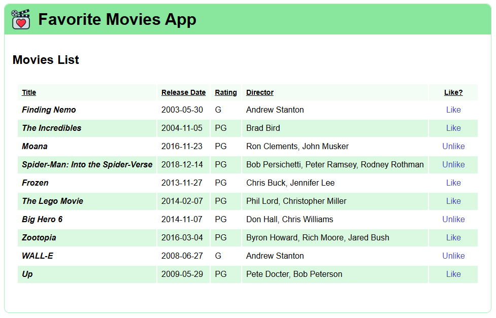

# Intro to React exercise

In this exercise you'll add components to a React application, display & style data in a component, and add interactivity with event handlers.

## Getting started

Open this folder in Visual Studio Code. Open a new Terminal pane and run `npm install` to install the dependencies.

As you work on each step, you can verify that you've completed requirements correctly by running the unit tests with the `npm run test` command.

It's a good idea to also run `npm run dev` so you can run and view the application in the browser and observe the changes you're making. It might be easier to notice something wrong before running the tests. Right now you won't see anything except a green outline of a box.

When you complete this exercise, you'll have an application that looks like:

Take a moment to explore the starting code, particularly in `src/App.jsx`, `src/components/AppHeader.jsx`, `src/views/MoviesView/MoviesView.jsx`, and `src/services/MovieService.js` as you'll be working with these files primarily.

The `MovieService` provides a hard-coded array as if it were from an actual data source like an API. Take note of the property names in the returned objects of the array. The `userLiked` property is a boolean indicating if the simulated logged-in user liked the movie.

## Step One: Add components to `App.jsx`

For this step you'll add the `AppHeader` and `MoviesView` components to `App.jsx`.

You must import the components and render their content in `App.jsx`. You must nest the `AppHeader` component under the `div` element, and the `MoviesView` component under the `main` element.

After completing this step correctly, the tests labeled "Step One" under "App component tests" pass. You'll also see the contents of `AppHeader` and `MoviesView` render in the browser.

## Step Two: Add movie table to `MoviesView`

For this step, import the `MovieService.js` file into the `MoviesView` component and assign the return value of `MovieService.getMovies()` to a local variable.

Create a `<table>` element in the `MoviesView` output. The `<table>` must have a `<thead>` with five column headers, one for each of the properties of a movie returned from the `MovieService`—Title, Release Date, Rating, Director, and one for the Like status. The order of the columns and their names don't matter.

In the table body, loop through your variable holding the data returned from `MovieService` and create a table row for each. In each row, create table cells and display the movie's title, release date, rating, director, and the like status (displayed "Liked" if `userLiked` is true, nothing if false). Don't modify or format any other data.

Once you complete this step correctly, the tests labeled "Step Two" under "MoviesView component tests" pass. You'll also see the table rendered in the browser.

## Step Three: Style movie table

Import the `MoviesView.module.css` file into the `MoviesView` component.

Add the CSS class `table-full` from the imported CSS module to the `<table>` element. The table cell with the movie title must have the `movie-title` CSS class from the imported CSS module.

The tests labeled "Step Three" under "MoviesView component tests" pass when you complete this step. In the browser, the table is now wider and the movie title is bold and italic.

## Step Four: Create "Like/Unlike" button

For the "like status" column in the table, remove the static text you used in the earlier steps and create a `<button>` element to represent the status. The button must use the `like-button` CSS class from the imported CSS module.

If the user _liked_ the movie, the button must display "Unlike"; If the user _didn't like_ the movie, the button must display "Like" instead.

If you complete this step correctly, the "Step Four" test under "MoviesView component tests" passes. In the browser, the "like" column now has a clickable button.

## Step Five: Create event handler

Create an event handler for when the user clicks the "Like/Unlike" button.

The button must have the follow behavior when clicked:

* If the button reads "Like", change it to "Unlike"
* If the button reads "Unlike", change it to "Like"

When you complete this step, the tests labeled "Step Five" under "MoviesView component tests" pass. In the browser, you'll see the button text change when you click it.
