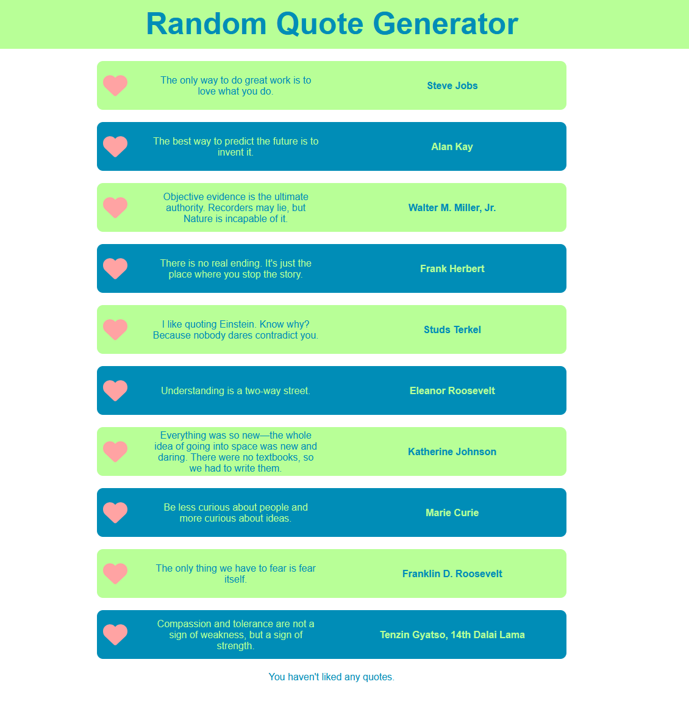

# Intro to React tutorial

In this tutorial you'll take your first steps in creating a **React** application with minimal starter code. Some features in this tutorial use "vanilla" JavaScript and locally stored data—you'll replace these features in later tutorials as you learn to leverage more of the potential in React. Each of the React tutorials involve working on the **Quote Generator** application, which you'll see slowly evolve as you learn more of **React** and iterate upon previous tutorial code.

## Setup

Open a terminal at the `tutorial` path. With your terminal working from this directory, run the `npm install` command. This installs any files necessary for your application to run.

You can run the application with the `npm run dev` command in your terminal. You can open the URL it returns to load the application. This becomes useful later on in the tutorial after you've added some content to the application.

## Review starting code

### Review `App.jsx`

To get started, you'll first want to review the pre-existing code for this application. The `<div>` in `src/App.jsx` serves as the container or parent component of the application. To start, it contains an `<h1>` which you'll soon see refactored into a component:

```js
export default function App() {

  return (
    <div id="quote-app">
      <header>
        <h1>Random Quote Generator</h1>
      </header>
    </div>
  );
}
```

### Optional: How does this get to the browser?

It isn't pressing to understand this process, but if you'd like a little more understanding on how React injects your components into the base HTML of your application, you can take a look at `src/main.jsx`. It imports the `App.jsx` component and renders it:

```js
createRoot(document.getElementById('root')).render(
  <StrictMode>
    <App />
  </StrictMode>,
);
```

Where does it render? The `document.getElementById('root')` might look familiar, this retrieves the element with the id `root`. That element is in `src/index.html`:

```html
<div id="root"></div>
```

This `<div id="root">` serves as the entry point for your application, which the `render()` function targets and then mounts your `App.jsx` code to.

### Review `QuoteService.js`

The `QuoteService` located at `services/QuoteService.js` stores an array of quote data for your application. In later tutorials, you'll request the data from an API server.

### Review `AppHeader.jsx`

This tutorial provides a completed `AppHeader` component that you'll use as a "refactor" of the existing code in your `App.jsx`. You can find the component in your `src/components/AppHeader` directory. Take a look at the component code—it's nearly identical to what you'll start with in `App.jsx`, but the AppHeader version references the provided CSS module `AppHeader.module.css`:

```HTML
<h1 className={styles.appTitle}>Random Quote Generator</h1>
```

The value for the `className` attribute `{styles.appTitle}` is referring to the `styles` object imported at the top of `AppHeader`:

```js
import styles from './AppHeader.module.css';
```

The `.appTitle` property is referring to the CSS rule by the same name, found in the CSS module for AppHeader—take a look at the module to see what styling you can expect once you add this component to your application.


## Step One: Implement `AppHeader`

The first component you'll work with for this application is the `AppHeader`—a componentized version of the `<header>` currently present in `App.jsx`. To start, import the `AppHeader` component into `App.jsx`:

```js
import AppHeader from './components/AppHeader/AppHeader';
```

With `AppHeader` imported, you're now able to implement the component within the JSX return of `App.jsx`—replace the existing `<header>` code with your `AppHeader` component:

```js
import AppHeader from './components/AppHeader/AppHeader';

export default function App() {

  return (
    <div id="quote-app">
      <AppHeader />
    </div>
  );
}
```

After these changes, you can see that your application now has a fully styled header.

## Step Two: Create, style, and implement `QuoteView.jsx`

### Create the `QuoteView` component

Now you'll be working on a brand new component that represents a complete "page" or "view" of content to display to your users. You'll categorize components of this type in a separate `views` folder within your project. Create the `views` folder within your `src` folder—`src/views`.

Create a `QuoteView` folder within your new `views` folder. Now create a new file within the `QuoteView` folder and name it `QuoteView.jsx`. Notice that the process is the same as creating any other component—views are just categorized differently as they're not typically reusable and serve a different purpose than traditional components.

Insert the following code snippet into your `QuoteView.jsx`:

```js
export default function QuoteView() {

  return (
    <>
      <div>

      </div>
    </>
  );
}
```

### Add styling to `QuoteView`

This sets up the structure for your `QuoteView` component. Now you're ready to add some CSS to provide styling for the features you'll add shortly. To set your CSS up, create a CSS module for `QuoteView`. You'll want to create this file in the same directory as your `QuoteView` component:

`src/views/QuoteView/QuoteView.module.css`

You can use the following CSS—add it to your `QuoteView.module.css`:

```css
.quote-container {
  display: flex;
  flex-direction: column;
  justify-content: center;
  align-items: center;
  width: 100%;
}

.quote, .quote-even, .quote-odd {
  font-size: 1rem;
  display: flex;
  align-items: center;
  justify-content: center;
  width: 600px;
  height: 3rem;
  padding: 0.5rem;
  margin-bottom: 1rem;
  border-radius: 0.5rem;
}

.quote p, .quote-even p, .quote-odd p {
  margin: 0;
  padding: 2rem;
  font-size: 0.8rem;
  text-align: center;
  width: 100%;
}

.quote-even {
  background-color: #008db7;
}

.quote, .quote-odd {
  background-color: #b8ff97;
}

.quote-even p {
  color: #b8ff97;
}

.quote p, .quote-odd p {
  color: #008db7;
}

.author {
  text-align: right;
  font-weight: bold;
}

.likesCounter {
  padding: 0;
  text-align: center;
  margin: 0;
  font-size: 0.8rem;
  color: #008db7;
  width: 100%;
}

.icon-favorite {
  color: #ffa3a3;
  font-size: 2rem;
}

.icon-favorite:hover {
  color: #e92121;
  cursor: pointer;
}

.icon-favorite-active {
  color: #ff0000;
}
```

You'll need to import this CSS module into your `QuoteView` component to be able to use it. Import the CSS module:

```js
import styles from './QuoteView.module.css';
```

The existing `<div>` in `QuoteView` serves as the container for quote data that you'll be adding shortly. Apply the CSS rule for `.quote-container` to the `<div>`:

```HTML
<div className={styles.quoteContainer}>
```

With the structure and styling of the component now ready, you can begin adding content to the component using the data stored in your `QuoteService`. The `QuoteService` has a set of quote data stored in an array that you can use here. To use that data in this component, you'll first need to import the `QuoteService` to this component:

```js
import QuoteService from '../../services/QuoteService';
```

With the service imported, you can now call the `getQuotes()` function within the `QuoteService`, which returns the array of quote data. You can use the array `map()` function to generate JSX for each element in the array:

```js
return (
    <>
      <div className={styles.quoteContainer}>
        {QuoteService.getQuotes().map((quote) => (
          <div className={styles.quote} key={quote.id}>
            <p>
              {quote.text}
            </p>
            <p className={styles.author}>
              {quote.author}
            </p>
          </div>
        ))}
      </div>
    </>
  );
```

Take a moment to review the code—this is an example of ***iterative rendering***.

```
Tip: if you need a refresher on JavaScript array functions like `map()`, take a look back at the unit covering those lessons and the related MDN doc:

https://lms.techelevator.com/content_link/gitlab.com/te-curriculum/client-side-javascript-lms/02_JavaScript_Essentials_Part_2/01-function-callbacks.md

https://developer.mozilla.org/en-US/docs/Web/JavaScript/Reference/Global_Objects/Array/map
```

### Implement `QuoteView`

With the structure and styling of `QuoteView` in place, you're ready to add the component to your application. Head over to `App.jsx`.

Import the `QuoteView` component:

```js
import QuoteView from './views/QuoteView/QuoteView';
```

Once imported, add the component to the JSX return statement:

```js
return (
    <div id="quote-app">
      <AppHeader />
      <QuoteView />
    </div>
  );
```

After adding the component to your `App.jsx`, you'll be able to see a list of quotes and authors on the page.

## Step Three: Add a "like" feature

Now that your application has content for your user to view, you can begin working on more interactive features. In this step you'll add the ability for users to "like" quotes. You'll expand on the feature in later tutorials.

To start, head back to `QuoteView.jsx`. Add the following code inside the function body of `QuoteView`—this tracks and updates the number of quotes liked, as well as handling the user clicking the heart icon you're about to add:

```js
let likes = 0;

  function updateLikesDisplay() {
    const likesDisplay = document.getElementById('likes-counter');
    if (likes > 0) {
      likesDisplay.textContent = `You've liked ${likes} quotes.`;
    } else {
      likesDisplay.textContent = "You haven't liked any quotes.";
    }
  }

  function handleFavoriteClick(event) {
    const iconElement = event.currentTarget;
    const titleElement = iconElement.querySelector('title');

    if (titleElement.textContent === 'Like this quote') {
      titleElement.textContent = 'Unlike this quote';
      iconElement.classList.add(styles.iconFavoriteActive);
      likes++;
    } else {
      titleElement.textContent = 'Like this quote';
      iconElement.classList.remove(styles.iconFavoriteActive);
      likes--;
    }
    updateLikesDisplay();
  }
```

Next, import the Font Awesome component:

```js
import { FontAwesomeIcon } from '@fortawesome/react-fontawesome';
```

Now, update your code in the JSX return of `QuoteView`:

```js
return (
    <>
      <div className={styles.quoteContainer}>
        {QuoteService.getQuotes().map((quote) => (
          <div className={styles.quote} key={quote.id}>
            <FontAwesomeIcon
              className={styles.iconFavorite}
              icon="fa-solid fa-heart"
              title="Like this quote"
              onClick={handleFavoriteClick}
            />
            <p>
              {quote.text}
            </p>
            <p className={styles.author}>
              {quote.author}
            </p>
          </div>
        ))}
        <p id="likes-counter" className={styles.likesCounter}>{"You haven't liked any quotes."}</p>
      </div>
    </>
  );
```

With these additions, your application now has a way to track and count how many quotes the user likes. Try it out for yourself and then take a moment to review the code you've just added.

`<FontAwesomeIcon>` is a component that allows for simple integration of the Font Awesome icon library. The `icon` attribute allows you to customize the style and type of icon shown. This library has been pre-installed for this tutorial.

The `onClick` attribute of the `<FontAwesomeIcon>` calls the `handleFavoriteClick()` function that you added earlier. When a user clicks on the heart icon, the function runs—follow the logic of the `handleFavoriteClick()` function and analyze how it uses the **click** event to manipulate the page.

## Step Four: Use conditional rendering to vary styling

Now that the application is functional, you can start working on "spicing up" the style to make your content more visually appealing. A great way to accomplish this is with **conditional rendering**—using conditional logic to alter the way content appears for your users.

In `QuoteView.jsx`, replace the following code:

```HTML
<div className={styles.quote} key={quote.id}>
```

With this new version that uses a ternary operator to conditionally change the CSS rule applied based on the evenness of the `id` for each `quote`:

```js
<div className={quote.id % 2 === 0 ? styles.quoteEven : styles.quoteOdd} key={quote.id}>
```

The CSS module for `QuoteView` already contains rules for `.quoteEven` and `.quoteOdd`. Take a moment to review the CSS module if you'd like a closer look at the styles applied.

Your application now shows alternating color schemes for the quote content.

If you have any questions or would like to know more about any of the topics covered in this tutorial, make sure to reach out to your instructor.


