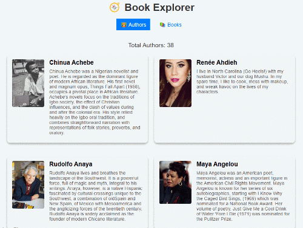

# React Hooks and Data Flow exercise

In this exercise, you'll build a React application that displays authors and books, and allows users to "like" books. You'll practice using React components, state, props, callbacks, and fetching data from an API service.

## Getting started

Open this folder in Visual Studio Code. Open a new Terminal pane and run `npm install` to install the dependencies.

As you work on each step, you can verify that you've completed requirements correctly by running the unit tests with the `npm run test` command.

It's a good idea to also run `npm run dev` so you can run and view the application in the browser and observe the changes you're making. It might be easier to notice something wrong before running the tests. Right now, you'll only see the title, nav, and placeholders because you need to implement the missing pieces.

When you complete this exercise, you'll have an application that looks like:

Take a moment to explore the starting code, particularly in `src/views/AuthorsView/AuthorsView.jsx`, `src/components/AuthorCard/AuthorCard.jsx`, `src/views/BooksView/BooksView.jsx`, and `src/components/BookCard/BookCard.jsx`. You'll primarily be working with these files.

The `src/services/BookService.js` service layer file provides methods to retrieve data from the [Books API](https://teapi.netlify.app/docs/books-api/docs) and return promises. It's a good idea to review the API documentation, particularly the [Books endpoint](https://teapi.netlify.app/docs/books-api/docs#endpoint-books) and [Authors endpoint](https://teapi.netlify.app/docs/books-api/docs#endpoint-authors) so you know what object properties to expect.

Also take note of the image properties in the API, they're a partial URL (like `/images/books/the_street_cover.jpg`) and need the root `https://teapi.netlify.app` prefixed to it for the browser to render it.

## Step One: Implement `AuthorsView`

For this step, when the view loads fetch a list of authors using `BookService.getAuthors()` and store it in state. The code provides a loading message that you must also display while it's retrieving the data (there's currently a hard-coded `false` that you can replace).

Render the total number of authors in the `
` element with the `authorCounter` class.

Then, `map` over the list of authors and render an `AuthorCard` component for each one inside the `
` container. Pass each author as a prop named `author` to `AuthorCard`, you'll use this in the next step.

After completing this step correctly, the tests labeled "Step One" under "AuthorsView tests" pass. In the browser you'll see the number of authors and a series of empty boxes in the browser.

## Step Two: Implement `AuthorCard`

For this step, update the `AuthorCard` component to accept the `author` prop you passed in on the last step and use it to display the author's full name, bio/about information, and profile image.

For the `` element, set the `src` attribute to the author's image. Remember that you must add `https://teapi.netlify.app` to the beginning of it so the browser can render the image.

Render the author's name in the `<h2>` element and the author's "about" information in the `
` element.

Once you complete this step correctly, the tests labeled "Step Two" under "AuthorCard tests" pass. You'll also see author cards with data in the browser.

## Step Three: Implement `BooksView`

For this step, fetch a list of books from `BookService.getBooks()` and store it in state. The code provides a loading message that you must also display while it's retrieving the data (there's currently a hard-coded `false` that you can replace).

Render the total number of books in the `
` element with the `totalCounter` class. (You don't need to worry about the `likeCounter` yet, you'll add that in a later step.)

Then, `map` over the list of books and render a `BookCard` component for each one inside the `
` container. Pass each book as a prop named `book` to `BookCard`, you'll use this in the next step.

Once you complete this step correctly, the tests labeled "Step Three" under "BooksView tests" pass. On the "Books" page of the application you'll see the total number of books as well as a series of boxes with a blue button in each one.

## Step Four: Implement `BookCard`

For this step, update the `BookCard` component to accept the `book` prop you passed in on the last step and use it to display the book's title, overview, and cover image.

For the `` element, set the `src` attribute to the book's cover image. Remember that you must add `https://teapi.netlify.app` to the beginning of it so the browser can render the image.

Render the book's title in the `<h2>` element and the book's overview in the `
` element.

Replace the current text of the `<button>` element with `likeText`. You'll make this dynamic in the next step.

Once you complete this step correctly, the tests labeled "Step Four" under "BookCard tests" pass. In the browser, you'll see the book cards with data.

## Step Five: Implement the "Like" feature

In this step you'll work in both `BooksView` and `BookCard` to complete the "Like" feature of the application.

Create a state variable in `BooksView` to track the number of liked books and set its initial value to `0`. Render the current value in the `
` element with the `likeCounter` class. (It's next to the `totalCounter` that you updated in an earlier step.)

Create a handler function that increments or decrements the like counter, and pass this function as a prop named `onLike` to `BookCard`. The handler function must take a number parameter that adjusts the like counter—for example, `1` when the user likes a book and `-1` when they unlike it.

Modify `BookCard` to accept this function as a prop. Create a state variable to track the current book's like status.

Modify the `<button>` element to display `likeText` or `likedText` based on the current like status.

(In `BookCard.module.css`, there's a `.liked` rule that you can use to style the `<button>` element differently if the user likes the book. This is optional and not scored.)

Create an event handler for when the user clicks the button. The event handler must updated the state variable you created in this step, and call the callback function from `BooksView` to update the number of liked books. If the user likes a book, increase the count. If the user clicks the button again to unlike it, decrease the number.

When you complete this step, the tests labeled "Step Five" under "BookCard tests" and "BooksView tests" pass. In the browser, you'll see the liked book count update as users interact with the buttons.
