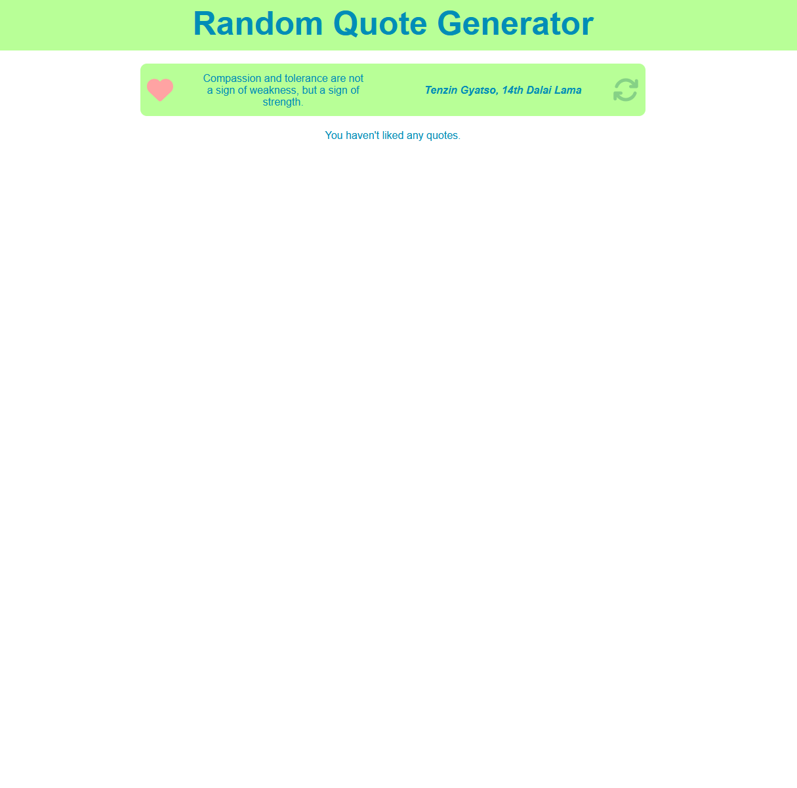

# React Hooks and data flow tutorial

In this tutorial you'll rework some of the features from the first tutorial to leverage React Hooks instead of vanilla JavaScript for the state management of your application.

## Setup

Open a terminal at the `tutorial` path. With your terminal working from this directory, run the `npm install` command. This installs any files necessary for your application to run.

You can run the application with the `npm run dev` command in your terminal. You can open the URL it returns to load the application. This becomes useful later on in the tutorial after you've added some content to the application.

This tutorial uses a provided backend server to retrieve quotes. You can find the server application at `resources/api-servers/quote-server`. Ensure the backend server is running while working on this tutorial.

*Tip: you can run the server as you would a typical Java application. The server must be running so that your tutorial project can successfully send requests to it.*

## Review starting code

### `QuoteService.js`

The `QuoteService` located at `src/services/QuoteService.js` no longer uses hard-coded quote data. Individual "random" quotes are now retrieved through the `getRandomQuote()` function. You can find an example of the `quote` object structure within the service.

### `QuoteView.jsx`

The `QuoteView` located at `src/views/QuoteView/QuoteView.jsx` currently shows only a placeholder loading graphic. The `<div>` with the CSS class `dot-pulse` is what renders the animation. You can find the CSS for the animation in the `public/css/three-dots.css` file if you'd like to inspect it.

## Step One: Use React Hooks to render a random quote in `QuoteView`

The first major addition you'll make to this project is the ability to request a random quote from the backend server and then render it to the page. To get started, you'll need to declare a few state variables in `QuoteView.jsx` to allow your page to react and re-render any part of your page that relies on these variables.

First, import `useState`:

```js
import { useState } from 'react';
```

Now, declare these state variables in `QuoteView.jsx`—just inside the `QuoteView` function:

```js
export default function QuoteView() {
  const [quote, setQuote] = useState({});
  const [isLoading, setIsLoading] = useState(true);
```

The intention with these variables is to allow your application to keep track of the current quote object shown, and if the page is currently loading or not.

Next, import the `QuoteService` into your `QuoteView` component:

```js
import QuoteService from '../../services/QuoteService';
```

After importing the service, implement this function into `QuoteView`:

```js
function handleFetchRandomQuote() {
  setIsLoading(true);
  QuoteService.getRandomQuote()
    .then((response) => {
      setQuote(response.data);
      setIsLoading(false);
    })
    .catch((error) => {
      console.error('Error fetching quote:', error);
      setIsLoading(false);
    });
}
```

This function works with the setter functions used by the state variables you declared earlier. It requests a quote from the backend server through the `QuoteService.getRandomQuote()` function call. After receiving a response, it assigns the quote data to your `quote` state variable with the `setQuote()` setter. Make note also of the updates to the value of the `isLoading` state variable at the different stages of this function's execution. Tracking and updating `isLoading` allows you to accurately show a loading graphic to the user while they wait for a response from the backend server.

With the `handleFetchRandomQuote()` function now in place, you can write some JSX that leverages the data managed by the `isLoading` and `quote` state variables. Update the return statement of `QuoteView` to use the following code:

```js
  return (
    <>
      <div className={styles.quoteContainer}>
        { isLoading ? (
          <div className={styles.loadingQuote}>
            <div className="dot-pulse"></div>
          </div>
        ) : (
          <div className={styles.quote}>
            <p>{quote.text}</p>
            <p className={styles.author}>
              <em>{quote.author}</em>
            </p>
          </div>
        )}
      </div>
    </>
  );
```

Take a moment to review the code—this snippet uses a ternary operator to *conditionally render* either the loading animation or elements populated with data from the `quote` object based on whether `isLoading` is true or false.

If you run your application at this stage, you'll notice that the loading animation works, but the quote never seems to finish loading. That's because you've written a function responsible for requesting a `quote` from the backend server and storing it in state, but you haven't called that function anywhere in your code yet.

The `useEffect` **Hook** is the perfect tool for this situation. You want to call the `handleFetchRandomQuote()` function when the component loads for the *first* time, but not on subsequent re-renders.

Import `useEffect` into your `QuoteView` component. You could write a separate import statement for `useEffect`, but JavaScript and React developers typically include all imports from a file or library in one line. Since `useEffect` and `useEffect` come from the same `react` library, you can add `useEffect` to the existing `import` for `useState`:

```js
import { useState, useEffect } from 'react';
```

Update your import to match.

Now add a call to the `useEffect()` function to `QuoteView`. A good spot for this would be right before the `return` statement:

```js
  useEffect(() => {
    handleFetchRandomQuote();
  }, []);

  return (
```

With this addition, the `QuoteView` component now runs the `handleFetchRandomQuote()` function when it loads for the first time.

Run your application and check to see the results of this change. Make sure your backend server is running to handle your requests. You'll now see quote data is properly loading into state and that your code to conditionally render quote data is working.

## Step Two: Componentize the quote code

Now that the basics of rendering a random quote to the page are complete, you can look into encapsulating some of your code by breaking away what's responsible for rendering an individual quote into a separate component. The main benefits of this are reusability and a less error prone environment for expansion on quote-specific features.

Begin by creating a `Quote` folder in your `src/components` folder. Once created, create a file named `Quote.jsx` within the `src/components/Quote` folder.

Add the following code to your `Quote` component:

```js
export default function Quote() {
  return (
    <div>
      <p>{quote.text}</p>
      <p>
        <em>{quote.author}</em>
      </p>
    </div>
  );
}
```

Notice that this code still references the `quote` object from `QuoteView`. You'll need to pass that data to this component for it to work properly. Start by declaring a prop for the `quote` data in function signature for `Quote()`:

```js
export default function Quote({ quote }) {
```

You'll provide the prop data to this component shortly. Head over to the `QuoteView` component to implement your new `Quote` component.

Import the `Quote` component to `QuoteView`:

```js
import Quote from '../../components/Quote/Quote';
```

Now replace the existing code in the `return` for `QuoteView` with the following:

```js
  return (
    <>
      <div className={styles.quoteContainer}>
        {isLoading ? (
          <div className={styles.loadingQuote}>
            <div className="dot-pulse"></div>
          </div>
        ) : (
          <Quote quote={quote} />
        )}
      </div>
    </>
  );
```

Take a moment to review the code. The `quote={quote}` attribute of the `<Quote />` element is how you send the `quote` data from the `QuoteView` state variable down to the `Quote` component with a prop. To break it down further, the left side, `quote=`, is the name of the prop that you're assigning to. This matches up with the prop in the `Quote` component—`{ quote }`. The right side, `{quote}`, is the data assigned to that prop. In this case, that's the value of the `quote` state variable.

If you run your application you'll notice that the quote data loads, but it's not styled. To add styling to the `Quote` component, create a file named `Quote.module.css` in your `src/components/Quote` folder.

Add the following CSS:

```css
.quote {
  font-size: 1rem;
  display: flex;
  align-items: center;
  justify-content: center;
  width: 600px;
  height: 3rem;
  padding: 0.5rem;
  margin-bottom: 1rem;
  background-color: #b8ff97;
  border-radius: 0.5rem;
}

.quote p {
  margin: 0;
  padding: 2rem;
  font-size: 0.8rem;
  color: #008db7;
  text-align: center;
  width: 100%;
}

.author {
  text-align: right;
  font-weight: bold;
}
```

Now import the CSS module into the `Quote` component:

```js
import styles from './Quote.module.css';
```

And add the CSS classes from the imported `styles` to the `div` and `p` elements:

```js
  return (
    <div className={styles.quote}>
      <p>{quote.text}</p>
      <p className={styles.author}>
        <em>{quote.author}</em>
      </p>
    </div>
  );
```

You now have a fully componentized version of the code responsible for rendering quotes.

## Step Three: Implement the "refresh" and "like" features

To finish up, you'll add the ability for the user to load a new random quote from the server and the ability to "like" a quote.

### The "refresh" feature

The ability to "refresh" the quote is the first feature you'll add. You'll add a button to the `Quote` component that a user can click to request a new quote. This presents an issue—the button exists in the `Quote` component, but the `quote` data exists as state in the `QuoteView` component. In cases like this, you can pass a function from the parent down to the child component as a `prop`. This allows your child component to trigger behavior in the parent through what's referred to as a *callback function*.

Head back to the `Quote` component.

Import the Font Awesome Icon component, which is pre-installed for this tutorial:

```js
import { FontAwesomeIcon } from '@fortawesome/react-fontawesome';
```

Update the JSX in `Quote` to include a `<FontAwesomeIcon>`:

```js
    <div className={styles.quote}>
      <p>{quote.text}</p>
      <p className={styles.author}>
        <em>{quote.author}</em>
      </p>
      <FontAwesomeIcon
        icon="fa-solid fa-refresh"
        title="Get new quote"
      />
    </div>
```

Now, head back to the `QuoteView` component.

In order to pass down the `handleFetchRandomQuote()` function from `QuoteView` to `Quote`, you'll need to share the function as a `prop`. Update the `<Quote>` component in the JSX of `QuoteView`:

```js
<Quote
  quote={quote}
  onRefresh={handleFetchRandomQuote}
/>
```

This binds the `handleFetchRandomQuote()` function to a `prop` named `onRefresh`.

Head back to the `Quote` component.

Add `onRefresh` as a prop to the function signature for `Quote`:

```js
export default function Quote({ quote, onRefresh }) {
```

Now you can use `onRefresh` in your `Quote` component to trigger the `handleFetchRandomQuote()` function back in `QuoteView`.

Update the `<FontAwesomeIcon>` component so that the `onRefresh` function triggers when clicked:

```js
<FontAwesomeIcon
  onClick={onRefresh}
  icon="fa-solid fa-refresh"
  title="Get new quote"
/>
```

If you're running your application, you'll notice that the refresh button now works as intended. However, it could use a little visual polish.

Add the following CSS rule to your `Quote.module.css`:

```CSS
.icon-refresh {
  color: #86d186;
  font-size: 2rem;
  cursor: pointer;
}

.icon-refresh:hover {
  color: #11d111;
}
```

Apply the `icon-refresh` class to your `<FontAwesomeIcon>` component:

```js
<FontAwesomeIcon
  className={styles.iconRefresh}
  onClick={onRefresh}
  icon="fa-solid fa-refresh"
  title="Get new quote"
/>
```

Now your refresh button provides visual feedback when the user hovers their mouse over it. Subtle feedback like this can go a long way in improving the user experience and intuitiveness of your applications.

### The "like" feature

The last feature you'll add in this tutorial is the ability to "like" a quote. You'll expand on this in later tutorials when you work on keeping track of a user's favorite quotes. For now, the intention is only to keep a count of how many quotes the user has liked.

To start, head over to the `QuoteView` component. You can use a state variable to keep track of how many quotes the user has liked. Declare a state variable for `likes` in `QuoteView`:

```js
const [likes, setLikes] = useState(0);
```

The `quote` object contains a boolean property, `userLiked`, which signifies whether a user has liked a quote or not. You can write a function to manipulate this data and design your application to react to the value of this property. Add the following function to `QuoteView`:

```js
function handleFavoriteClick(quote) {
  if (quote.userLiked) {
    setQuote({ ...quote, userLiked: false });
    setLikes(likes - 1);
  } else {
    setQuote({ ...quote, userLiked: true });
    setLikes(likes + 1);
  }
}
```

Take a moment to review the code. Note how the function expects to receive a `quote` object as a parameter, and examines the `userLiked` property to determine which set of logic to run. The lines calling the `setQuote()` setter use the *spread syntax* to populate the object parameter with all of the properties existing in the current `quote` object held in state, and then overwrite the `userLiked` property with `true` or `false`. The lines calling `setLikes()` increment or decrement the value of `likes` based on if the user "liked" or "unliked" a quote.

```
Tip: if you'd like to refresh on spread syntax, take a look back at the JavaScript essentials section which discusses it:

https://lms.techelevator.com/content_link/gitlab.com/te-curriculum/client-side-javascript-lms/02_JavaScript_Essentials_Part_2/03-working-with-objects.md
```

Now that you have a function to handle the behavior of "liking" a quote, pass it down as a prop to the `Quote` component for use:

```js
<Quote
  quote={quote}
  onRefresh={handleFetchRandomQuote}
  onFavorite={handleFavoriteClick}
/>
```

Head over to the `Quote` component and add the `onFavorite` prop that you declared in `QuoteView`:

```js
export default function Quote({ quote, onRefresh, onFavorite }) {
```

Now add an icon that the user can click to trigger a "like" on a quote. Add it between the opening `<div>` and `<p>` tag for quote text:

```js
<div className={styles.quote}>
  <FontAwesomeIcon
    icon="fa-solid fa-heart"
    title={quote.userLiked ? "Unlike this quote" : "Like this quote"}
    onClick={() => onFavorite(quote)}
  />
  <p>{quote.text}</p>
```

Take a moment to examine the code. You may recall that the `handleFavoriteClick()` function requires a `quote` object as a parameter. When you want to trigger an event handler function with parameters (other than the `Event` object), you need to use the arrow function syntax in this way to avoid immediately calling the function when the component loads.

At this point the feature is functional, but could use better visuals to help the user keep track of whether they've liked the current quote or not. Add the following CSS to your `Quote.module.css` file:

```CSS
.icon-favorite, .icon-favorite-active {
  font-size: 2rem;
  cursor: pointer;
}

.icon-favorite {
  color: #ffa3a3;
}

.icon-favorite:hover {
  color: #e92121;
}

.icon-favorite-active {
  color: #ff0000;
}
```

Now add the following `className` attribute to your `<FontAwesomeIcon>` component for the "like" icon:

```js
<FontAwesomeIcon
  className={quote.userLiked ? styles.iconFavoriteActive : styles.iconFavorite}
  icon="fa-solid fa-heart"
  title={quote.userLiked ? "Unlike this quote" : "Like this quote"}
  onClick={() => onFavorite(quote)}
/>
```

Your icon now has visual feedback for when the user hovers their mouse over the icon and also for when the user has liked/unliked the `quote`.

Finally, add an element that shows the user how many quotes they've liked. Add the following code to `QuoteView`, as the last element in the `<div>` with the CSS class `quoteContainer`:

```js
<p id="likes-counter" className={styles.likesCounter}>
    {likes > 0 ? `You've liked ${likes} quotes.` : "You haven't liked any quotes."}
</p>
```

This approach uses a ternary operator to check if the value of `likes` is greater than 0, and then conditionally renders text based on whether that check was true or false.

For styling on this new element, you can add the following CSS to the `Quote.module.css`:

```CSS
.likes-counter {
  padding: 0;
  text-align: center;
  margin: 0;
  font-size: 0.8rem;
  color: #008db7;
  width: 100%;
}
```
When you complete the tutorial, it looks like:



If you have any questions or would like to know more about any of the topics covered in this tutorial, make sure to reach out to your instructor.
