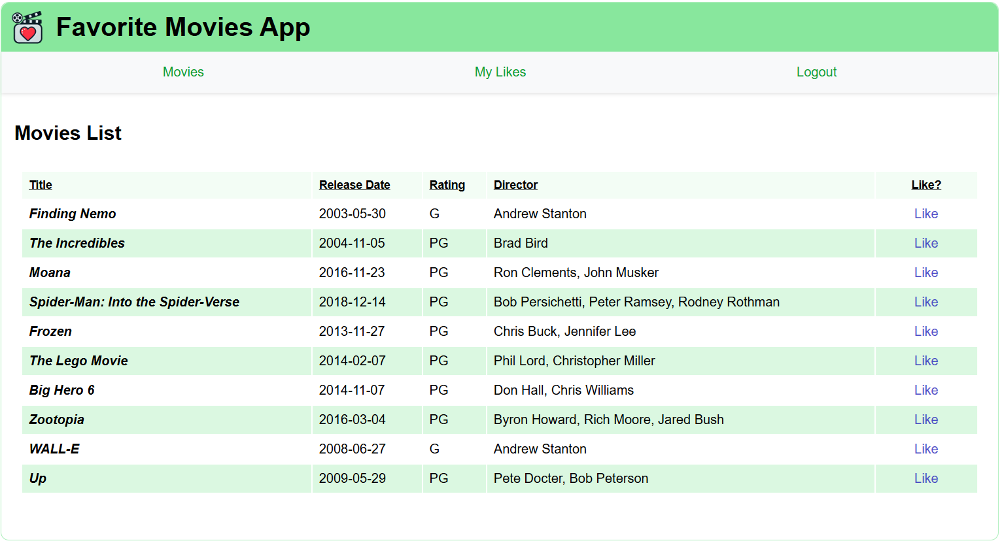

# Sharing Data Deeply exercise

The Favorite Movies App returns!

In this exercise you'll revisit a familiar React application to make a few key changes:

* Implement a **Context** object (UserContext) to allow the application to *react* to the authentication status of users
* Use **Axios** to communicate with your backend server for data handling

## Getting started

Open this folder in Visual Studio Code. Open a new Terminal pane and run `npm install` to install the dependencies.

As you work on each step, you can verify that you've completed requirements correctly by running the unit tests with the `npm run test` command.

It's a good idea to also run `npm run dev` so you can run and view the application in the browser and observe the changes you're making. It might be easier to notice something wrong before running the tests.

When you complete this exercise, you'll have an application that looks like:

Take a moment to explore the starting code, particularly in:

* `src/App.jsx`
* `src/components/Nav/Nav.jsx`
* `src/components/MovieTable/MovieTable.jsx`
* `src/views/MoviesView/MoviesView.jsx`
* `src/context/UserContext.jsx`
* `src/services/MovieService.js`

**You'll be working with these files primarily.**

This exercise communicates with a (provided) backend server and database to handle user authentication and movie data. You can find the server application at `resources/api-servers/favorite-movies-server`.

*Tip: you can run the server as you would a typical Java application. The server must be running so that your exercise can successfully send requests to it.*

In the previous Favorite Movies application exercise, the `MovieService` provided data to your application which was stored in the service itself as an array. This was a *hard-coded* solution. This time, your service uses **Axios** to both send and retrieve data through the backend server which in turn allows data to persist by way of the `FavoriteMoviesDB`.

## Step One: Implement `UserContext` in `App.jsx`

To begin sharing user data throughout the application, there are a few objectives to complete:

1. In `UserContext.jsx`, define a `UserContext` variable. Set the starting value for the context to `null`. Export it as `UserContext`.
2. In `App.jsx`, import your `UserContext` and then add a `UserContext` **Provider** component to the JSX `return` statement. Use the `user` **state** as the value for the Provider. Ensure that the Provider *wraps* the `Nav` and `ViewManager` components in the hierarchy that need to use the `user` **state**.

The tests labeled "Step One" under "UserContext tests" now pass after completing this step.

## Step Two: Use the provided context in `Nav.jsx`

Now that you're *providing* the user state to the other components in your application, you can begin to create features in those components that react to the value of your user state. You'll now set the `Nav` component up so that it shows either a link for Login or links for Likes and Logout depending on the state of your user.

In **Nav.jsx**:

1. Import `useContext` and your `UserContext`.
2. In the `Nav` function body, use the `useContext` Hook to define a `user` variable.
3. Take a look at the `isLoggedIn` variable. Currently it's *hard-coded* to false. If you examine the JSX return statement, you'll notice that there is a ternary operator which shows the Likes and Logout links if `isLoggedIn` is *true*, and shows a Login link if `IsLoggedIn` is *false*. Remove the hard-coded false value from `isLoggedIn` and replace it with a statement that checks to see if your `user` variable isn't null. This allows the ternary operator to react properly to the state of your user.

The tests labeled "Step Two" under "Nav tests" now pass after completing this step. The Nav now also properly changes based on the user's authentication. Try logging in as `movie_fan/password` to test it out. Note how your user state is in `App.jsx` and the `Nav` component is able to retrieve it.

## Step Three: Use the provided context in `MovieTable.jsx`

Upon examining the existing code in `MovieTable.jsx`, you may notice a few similarities to the setup of your `Nav.jsx`. This component also uses an `isLoggedIn` variable to determine what's shown to your users. You'll now make some changes to leverage the context provided to this component so that it properly reacts to the state of your user data.

1. Import `useContext` and your `UserContext`.
2. In the `MovieTable` function body, use the `useContext` Hook to define a `user` variable.
3. Adjust the `isLoggedIn` variable so that it returns true when the user variable isn't null.

The tests labeled "Step Three" under "MovieTable tests" now pass. When logged in, the table in the Movies List now shows a column for movies Liked by the user. You'll implement the Like/Unlike feature in the next step.

## Step Four: Complete the `handleLike()` function in `MoviesView.jsx`

Examine both the `handleLike()` function and JSX `return` of this component. Notice how `MoviesView` passes the function down to the `MovieTable` component through the `onLike` prop. This is how the `Like?` column in the `MovieTable` receives the logic for Liking/Unliking movies. You'll now implement the `handleLike()` function in `MoviesView.jsx` so that your users can successfully Like/Unlike movies.

The `handleLike()` function takes two parameters: `userLiked` and `movieId`. The `movieId` parameter allows your server to identify which movie the user is liking, and `userLiked` is the _current_ status of the movie before changing to Liked or Unliked. For example: if `userLiked` is true, that means the user is 'Unliking' a movie. The 'Liked' status of movies is stored in your database. That means you'll need to make API requests to your backend server to properly update that data. There are two functions in `MovieService` that make those requests. The service is already imported to the `MoviesView` component for you.

1. Use the imported `MovieService` object to call the appropriate functions within the if/else conditions of `handleLike()`. The functions return promises, so you need to handle those properly receiving a successful response or error.
2. On a successful response, call the `getPageData()` function to re-fetch updated data for the page.
3. On error, call the `setNotification()` function to notify the user of the issue. You can see an example of how to use this function in the error handling of the `getPageData()` function. The exact message doesn't matter, just as long as you call `setNotification()`.

The tests labeled "Step Four" under "MoviesView tests" now pass. When logged in, you'll now be able to successfully Like/Unlike movies in the table.
