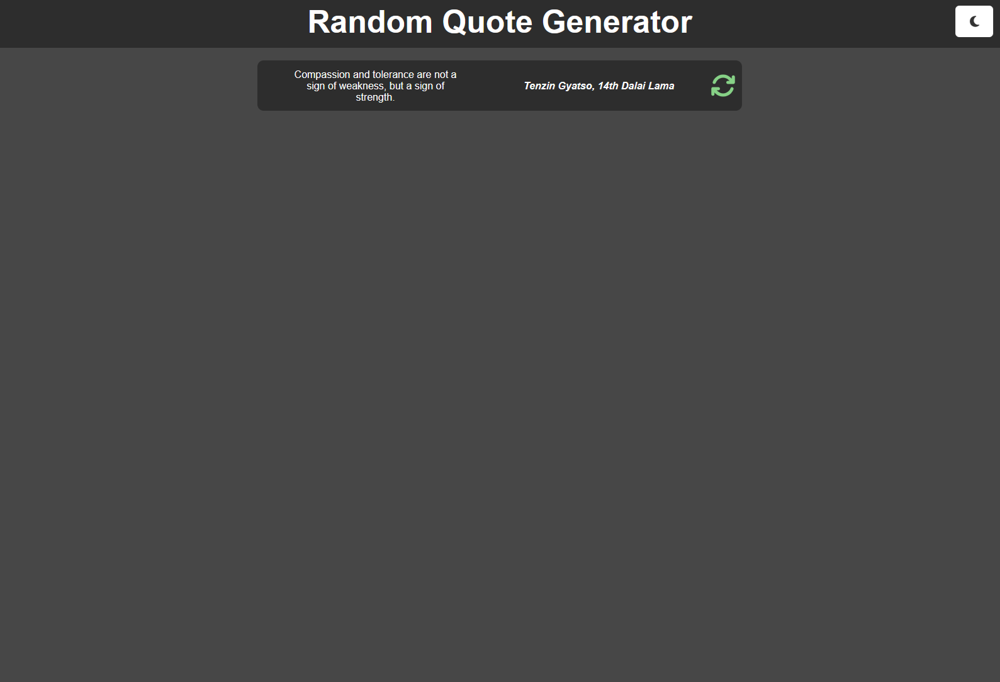

# Sharing data deeply tutorial

In this tutorial, you'll add a method for users to swap between dark/light themes by leveraging the **Context** feature of React.

## Setup

Open a terminal at the `tutorial` path. With your terminal working from this directory, run the `npm install` command. This installs any files necessary for your application to run.

You can run the application with the `npm run dev` command in your terminal. You can open the URL it returns to load the application. This becomes useful later on in the tutorial after you've added some content to the application.

This tutorial uses a provided backend server to retrieve quotes. You can find the server application at `resources/api-servers/quote-server`. Ensure the backend server is running while working on this tutorial.

*Tip: you can run the server as you would a typical Java application. The server must be running so that your tutorial project can successfully send requests to it.*

## Step One: Create ThemeContext

To get started, you'll first need to create a `ThemeContext`. The objective of this is to use the **Context** as a vehicle for sharing, or _providing_, the value of a `theme` state variable to any components that need it. A component can reference this **Context** to understand whether to display dark or light themed visuals.

### **ThemeContext.jsx**

Create a `ThemeContext.jsx` file inside the `src/context` folder. You may need to create a `context` folder inside `src` first.

Add the following code to your newly created `ThemeContext.jsx` file:

```js
import { createContext } from 'react';

export const ThemeContext = createContext('light');
```

This creates and exports a basic **Context** variable with a default value of `light`.

### **App.jsx**

Navigate to the `App.jsx` file and add the following imports for the `ThemeContext` and `useState`:

```js
import { useState } from 'react';
import { ThemeContext } from './context/ThemeContext';
```

Once imported, you can declare a state variable for `theme` using the `ThemeContext` as the `useState()` parameter:

```js
const [theme, setTheme] = useState(ThemeContext);
```

Now you have a `theme` state variable to keep track of the current application theme. Because the `ThemeContext` is the value of this variable, you're able to leverage the `<Context.Provider>` component to share this data to any component that requests it.

To implement the **Provider**, update the `return` statement in `App.jsx` to include the following code:

```js
  return (
    <div id="quote-app">
      <ThemeContext.Provider value={theme}>
        <AppHeader />
        <QuoteView />
      </ThemeContext.Provider>
    </div>
  );
```

With this change, any components within the scope of the opening and closing tags of the `<ThemeContext.Provider>` now have the ability to request, or ***consume***, the assigned **value**.

Now that your `<ThemeContext.Provider>` is essentially broadcasting the `theme` value to any components within its scope, you can begin to create features that require the `theme` value to behave properly.

To allow your lower-level "child" components to manipulate the `theme` state, you can create a **handler** function that you can pass down to those components, allowing them access to the higher-level state variable setter.

Add the following function to `App.jsx`, just before the `return` statement:

```js
function handleThemeChange() {
  setTheme(theme === 'light' ? 'dark' : 'light');
}
```

This function calls the setter `setTheme()` for the `theme` state variable and flips the value between `light` and `dark`. You'll pass this handler function to the `<AppHeader />` component as a callback prop shortly, where you'll use it to drive the behavior of a theme toggle button.

Update the `<AppHeader />` in the `return` statement to include the `handleThemeChange()` function as a callback prop:

```js
<AppHeader onThemeChange={handleThemeChange} />
```

The distinction of "on" and "handle" in the prop/function names are commonly used to allow you to quickly determine when a function's purpose is to either "handle" an update or react "on" a triggering change.

In this case the handler, `handleThemeChange()`, is the function responsible for directly updating the `theme` state variable, and the `onThemeChange` callback is just a way to remotely trigger the handler from another component.

Before moving on to changes in other components, add the following line to `App.jsx`, just before the `return` statement, outside of any function:

```js
document.body.className = theme === 'light' ? 'light-mode' : 'dark-mode';
```

This assigns a `light-mode` or `dark-mode` class to the `body` element of the document based on the value of the `theme` state variable. This statement runs whenever the `App.jsx` component renders, so it updates whenever the `theme` state variable changes.

### **ThemeControl.jsx**

Now that all of the necessary groundwork is complete, you can create a component that acts as the toggle button for the theme of the application. You can then install that component anywhere in your application where you'd like the user to be able to update the theme.

Create a `ThemeControl` folder in `src/components`, and then create both a `ThemeControl.jsx` file and a `ThemeControl.module.css` file inside of that new folder.

Add the following code to `ThemeControl.jsx`:

```js
import { useContext } from 'react';
import { ThemeContext } from '../../context/ThemeContext';
import { FontAwesomeIcon } from '@fortawesome/react-fontawesome';
import styles from './ThemeControl.module.css';

export default function ThemeControl({ onThemeChange }) {
  const theme = useContext(ThemeContext);
  const controlButtonThemed = theme === 'light' ? styles.controlButtonLight : styles.controlButtonDark;

  return (
    <div>
      <button
        className={`${styles.controlButton} ${controlButtonThemed}`}
        onClick={onThemeChange}
      >
        <FontAwesomeIcon className={controlButtonThemed} icon={`fa-solid ${theme === 'light' ? 'fa-sun' : 'fa-moon'}`} />
      </button>
    </div>
  )
};
```

Take a moment to examine the component code. The objective of this component is to provide a modular button that you can install anywhere in your project to add a theme toggling capability. An important detail to note is that this component expects to receive an `onThemeChange` prop, which is a callback function triggered when the user clicks on the `<button>`. You'll fulfill the prop requirement shortly, when you install this component to the `AppHeader`.

Add the following code to `ThemeControl.module.css` for styling:

```CSS
.control-button {
  height: 2.5rem;
  width: 3rem;
  font-size: 1rem;
  border-radius: 5px;
  cursor: pointer;
  border: 0;
  display: flex;
  align-items: center;
  justify-content: center;
  padding: 10px;
}

.control-button-light {
  background-color: #333333;
  color: #ffffff;
}

.control-button-dark {
  background-color: #ffffff;
  color: #333333;
}
```

### **AppHeader.jsx**

Now that the `ThemeControl` component is complete, it's ready for installation in your application. In this project, you'll place it in the `AppHeader`.

Open `AppHeader.jsx`.

Replace the existing `AppHeader` code with the following:

```js
import styles from './AppHeader.module.css';
import { useContext } from 'react';
import { ThemeContext } from '../../context/ThemeContext';
import ThemeControl from '../ThemeControl/ThemeControl';

export default function AppHeader({ onThemeChange }) {
  const theme = useContext(ThemeContext);
  const appTitleThemed = theme === 'light' ? styles.appTitleLight : styles.appTitleDark;

  return (
    <header className={styles.appHeader}>
      <h1 className={`${styles.appTitle} ${appTitleThemed}`}>Random Quote Generator</h1>
      <div className={styles.controlContainer}>
        <ThemeControl onThemeChange={onThemeChange} />
      </div>
    </header>
  );
}
```

Now your `AppHeader` includes a button which toggles the `theme` of the application. It now also reacts to the value of the `theme` state variable which it receives as **Context** from the `<ThemeContext.Provider>`.

## Step Two: Adding theme reactivity

The application now has a way to keep track of the current `theme` as a state variable and can both share and manipulate that value throughout the application. To finalize the `theme` feature, you'll just need to adjust the styling of `Quote.jsx` to use the appropriate CSS rules based on the current value of `theme`.

### **Quote.jsx**

Navigate to `Quote.jsx` and replace the existing code with the following:

```js
import styles from './Quote.module.css';
import { FontAwesomeIcon } from '@fortawesome/react-fontawesome';
import { useContext } from 'react';
import { ThemeContext } from '../../context/ThemeContext';

export default function Quote({ quote, onRefresh }) {
  const theme = useContext(ThemeContext);
  const quoteThemed = theme === 'light' ? styles.quoteLight : styles.quoteDark;

  return (
    <div className={`${styles.quote} ${quoteThemed}`}>
      <p>{quote.text}</p>
      <p className={styles.author}>
        <em>{quote.author}</em>
      </p>
      <FontAwesomeIcon
        className={styles.iconRefresh}
        onClick={onRefresh}
        icon="fa-solid fa-refresh"
        title="Get new quote"
      />
    </div>
  );
}
```

This update to `Quote.jsx` adds two new variables—`theme` and `quoteThemed`. The value assigned to `theme` here originates from the state variable that you created earlier in `App.jsx`, which `ThemeContext` is providing to this component. The `quoteThemed` variable uses a ternary operator to determine whether `quoteThemed` receives a value of `styles.quoteLight` or `styles.quoteDark`. That value is then applied as a CSS class to the `<div>` element in the `return` statement so that it uses the appropriate styling based on the current `theme`.

With these changes, the `theme` feature is now complete. You can now toggle between light and dark modes and your application styles itself appropriately.

After completing the tutorial, this is the expected final result:



If you have any questions or would like to know more about any of the topics covered in this tutorial, make sure to reach out to your instructor.
