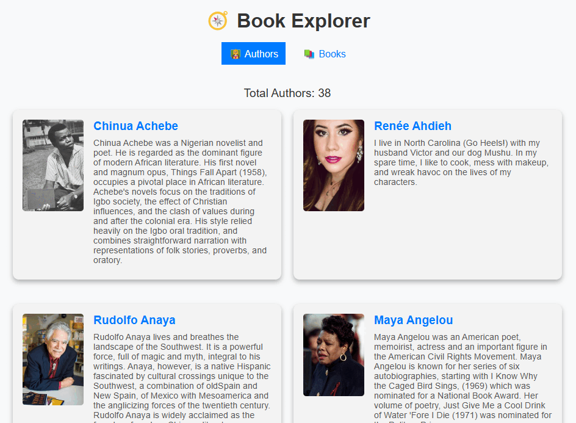

# React Router exercise

In this exercise you'll revisit the "Book Explorer" application and add navigation by using some of the following **React Router** features:

* URL path-based component rendering with `<Route>`
* Content navigation with `<Link>` and `<NavLink>`
* Rendering dynamic content with parameterized URLs and extraction of parameter values with `useParams()`

## Getting started

Open this folder in Visual Studio Code. Open a new Terminal pane and run `npm install` to install the dependencies.

As you work on each step, you can verify that you've completed requirements correctly by running the unit tests with the `npm run test` command.

It's a good idea to also run `npm run dev` so you can run and view the application in the browser and observe the changes you're making. It might be easier to notice something wrong before running the tests.

When you complete this exercise, you'll have an application that looks like:

Take a moment to explore the starting code, particularly in:

* `src/App.jsx`
* `src/components/AuthorCard/AuthorCard.jsx`
* `src/components/BookCard/BookCard.jsx`
* `src/views/AuthorDetailsView/AuthorDetailsView.jsx`
* `src/views/BookDetailsView/BookDetailsView.jsx`
* `src/services/BookService.js`

**You'll be working with these files primarily.**

The code for `App.jsx`, `AuthorCard.jsx`, and `BookCard.jsx` are very similar to the earlier exercise you worked on, with two notable changes—the "Like" counter has been removed and the page no longer loads author content by default.

The `AuthorDetailsView.jsx` and `BookDetailsView.jsx` files are new, their purpose is to show one Author or Book card, as well the author's books or the book's authors. Their features are mostly built out, but you need to update it with React Router features.

## Step One: Overhaul `App.jsx`

This application is currently navigated with the two buttons located in the `<nav>` of `App.jsx` which change the `view` state variable with their respective `onClick` behaviors. Below the `<nav>`, there is some code that conditionally renders a component depending on the value of the `view` state variable. While this is somewhat functional, it doesn't give each view a separate URL.

Wrap everything in the JSX with `<BrowserRouter>` and make the following changes.

Replace the view conditionals with a `<Routes>` container and define routes for the four views:

| View                | Path                             |
| ------------------- | -------------------------------- |
| `AuthorsView`       | `/authors`                       |
| `BooksView`         | `/books`                         |
| `AuthorDetailsView` | `/author/` + author ID parameter |
| `BookDetailsView`   | `/book/` + book ID parameter     |

Replace the buttons in `<nav>` with `<NavLink>` components linking to the routes for `AuthorsView` and `BooksView`. You don't need to worry about styling as an `active` class is already provided for you in `styles.css`.

(Optionally, you can remove the `view` state variable and the `useState` import as they're no longer used.)

The tests under "Step One Tests" now pass after completing this step. If you run the application it looks and behaves like before, but when you click the "Authors" and "Books" links, the URL changes too.

## Step Two: Link to author details view

In the screenshot GIF of the completed project, you may notice the titles of authors and books are now links. Each link brings the user to the respective details page.

In `AuthorCard.jsx`, make the `<h2>` for the author name a clickable link that brings the user to the route for `AuthorDetailsView`. Make sure to use the id from the `author` prop.

After completing this step, the tests under "Step Two Tests" pass. In the application you can click the author names to go to the details view. However, regardless of the author you click, it always displays Maya Angelou—you'll fix this in the next step.

## Step Three: Update author details view

In `AuthorDetailsView.jsx`, there's a hard-coded `authorId` assigned to the value for Maya Angelou (302203). Update this assignment to use the ID from the URL parameter (review the path you created in step one).

After you complete this step, the test under "Step Three Tests" passes. In the browser the page shows the correct author and their books.

## Step Four: Link to book details view

In `BookCard.jsx`, make the `<h2>` for the book title a clickable link that brings the user to the route for `BookDetailsView`. Make sure to use the id from the `book` prop.

The tests under "Step Four Tests" now pass after completing this step. In the application you can click the book titles to go to the details view. However, regardless of the book you click, it always displays _A Thousand Beginnings and Endings_—you'll fix this in the next step.

## Step Five: Update book details view and link back to authors

In `BookDetailsView.jsx`, there's a hard-coded `bookId` assigned to the value for _A Thousand Beginnings and Endings_ (102230). Update this assignment to use the ID from the URL parameter (review the path you created in step one).

Following the book card on the details page is the author or authors of the book. Update the display of the authors to link back to the author details page.

After you complete this step, the test under "Step Five Tests" passes. In the browser the page shows the correct book and its authors, and the author names link to their respective details pages.
