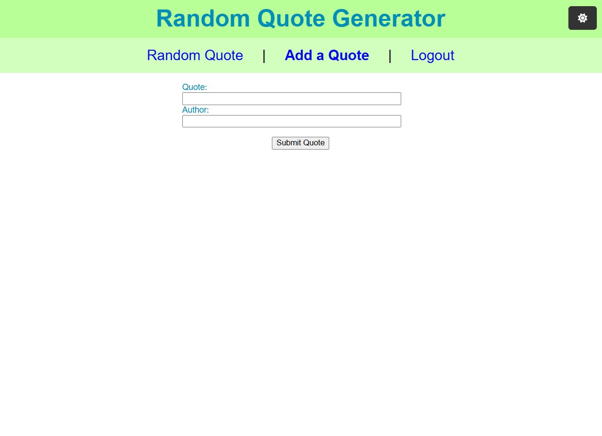

# React Router tutorial

In this tutorial, you'll work with the React Router library to implement client-side routing/content navigation to the Quotes application that you may have seen in previous React tutorials. You'll create a new component to house the `<Routes>` separately from `App.jsx`, create a navigation component with `<NavLink>`s, extract URL parameters with `useParams()`, and restrict content with a custom component.

## Setup

Open a terminal at the `tutorial` path. With your terminal working from this directory, run the `npm install` command. This installs any files necessary for your application to run.

You can run the application with the `npm run dev` command in your terminal. You can open the URL it returns to load the application. This becomes useful later on in the tutorial after you've added some content to the application.

This tutorial uses a provided backend server to retrieve quotes. You can find the server application at `resources/api-servers/quote-server`. Ensure the backend server is running while working on this tutorial.

**You can use the following credentials to log in with the role of `USER`:**

`username: quote_fan`
`password: password`

*Tip: you can run the server as you would a typical Java application. The server must be running so that your tutorial project can successfully send requests to it.*

## Step One: Implement content navigation

Currently, this application has a number of features ready for delivery to your users. There's one small issue with these features, however—your users have no way to navigate to them. In this step, you'll create a `MainContent` component which is responsible for housing the `<Routes>` of your application. After that, you'll implement an `AppNav` component which users can use as an interface for navigating your application.

### MainContent

Create a new file named `MainContent.jsx` inside the `src/components` folder.

Add the following code to `MainContent.jsx`:

```js
import { Routes, Route, Navigate } from "react-router-dom";
import LoginView from "../views/LoginView/LoginView";
import LogoutView from "../views/LogoutView";
import QuoteView from "../views/QuoteView/QuoteView";
import AddQuoteView from "../views/AddQuoteView/AddQuoteView";

export default function MainContent({ onLogin, onLogout }) {
  return (
    <main>
      <Routes>
        <Route path="/" element={<QuoteView />} />
        <Route path="/login" element={<LoginView onLogin={onLogin} />} />
        <Route path="/logout" element={<LogoutView onLogout={onLogout} />} />
        <Route
          path="/addQuote"
          element={
            <AddQuoteView />
          }
        />
        <Route path="*" element={<Navigate to="/" />} />
      </Routes>
    </main>
  );
}
```

Now you have a component with all of the `<Routes>` for your application planned out. Whenever the URL matches up with a `<Route>` path, the corresponding `element` renders. To see this in effect, you'll need to implement this new component into your `App.jsx`.

Open `App.jsx`.

Import the `BrowserRouter` component:

```js
import { BrowserRouter } from 'react-router-dom';
```

The `BrowserRouter` component is necessary to access **Router** features in your application. You'll install it shortly.

Next, import the `MainContent` component:

```js
import MainContent from "./components/MainContent";
```

Currently `App.jsx` is setup to show only the `QuoteView` and `AppHeader` components. When using **React Router**, you can instead leverage `<Routes>` to deliver content—just like you've done in the `MainContent` component.

Update the return statement of `App.jsx` with the following code:

```js
  return (
    <div id="quote-app">
      <BrowserRouter>
        <UserContext.Provider value={user}>
          <ThemeContext.Provider value={theme}>
            <AppHeader onThemeChange={handleThemeChange} />
            <MainContent onLogin={handleLogin} onLogout={handleLogout} />
          </ThemeContext.Provider>
        </UserContext.Provider>
      </BrowserRouter>
    </div>
  );
```
Take a moment to examine the code. Notice how `<BrowserRouter>` wraps the application. Any components inside the scope of `<BrowserRouter>` have access to **Router** features. `<MainContent>` has taken the spot of `<QuoteView>` as `<MainContent>` has the ability to ***"transform"*** into whatever component matches up with a `<Route>` path URL. The path assigned to `QuoteView` is `/`, or base path, so navigating to the IP/port your application is running on now shows that component. For example, `http://localhost:5173/`. The port can vary depending on what ports are available for use on your machine. Try running this application to see this in action. Make sure to run the backend `quote-server` as well to load quote data.

## Step Two: Navigation

With `MainContent` now installed, your application is able to show content based on the current URL. However, users currently have no way to navigate this content without manually typing in a URL. To make navigation easier, you can use the `<Link>` and `<NavLink>` components provided by **React Router**. To keep `App.jsx` clean, you can separate the navigation related code into a separate component.

Create a new folder named `AppNav` in your `src/components` folder. Inside that folder, create two new files named `AppNav.jsx`, and `AppNav.module.css`.

Add the following code to `AppNav.jsx`:

```js
import { useContext } from "react";
import { Link, NavLink } from "react-router-dom";
import { UserContext } from "../../context/UserContext";
import { ThemeContext } from "../../context/ThemeContext";

import styles from "./AppNav.module.css";

export default function AppNav() {
  const user = useContext(UserContext);
  const isLoggedIn = user !== null;

  const theme = useContext(ThemeContext);
  const navThemed = theme === 'light' ? styles.navLight : styles.navDark;

  return (
    <nav className={`${navThemed} ${styles.navigation}`}>
      <NavLink className={styles.link} to="/">
        Random Quote
      </NavLink>
      |
      {isLoggedIn ? (
        <>
          <NavLink className={styles.link} to="/addQuote">
            Add a Quote
          </NavLink>
          |
          <Link className={styles.link} to="/logout">
            Logout
          </Link>
        </>
      ) : (
        <NavLink className={styles.link} to="/login">
          Login
        </NavLink>
      )}
    </nav>
  );
}
```
Take a moment to review the code. This component uses `<NavLink> ` and `<Link>` components `to` navigate users to specific URLs which correspond with the `path`s assigned to the `<Route>`s back in the `MainContent` component.

Open `AppNav.module.css` and add the following CSS for styling:

```css
.navigation {
  display: flex;
  justify-content: center;
  align-items: center;
  gap: 2rem;
  padding: 1rem 0;
  font-size: 1.5rem;
}

.nav-light {
  color: #000000;
  background-color: #d2ffbd;
}

.nav-dark {
  color: #ffffff;
  background-color: #333333;
}

.link {
  color: #0505f0;
  text-decoration: none;
}

.link:hover {
  background-color: rgba(136, 193, 231, 0.5);
  text-decoration: underline;
  color: #0000ff;
}
```

With the styling now in place, the `AppNav` component is ready for implementation.

Open `App.jsx`.

Import the `AppNav` component:

```js
import AppNav from './components/AppNav/AppNav';
```

Now, update the return statement of `App.jsx` with the following code:

```js
  return (
    <div id="quote-app">
      <BrowserRouter>
        <UserContext.Provider value={user}>
          <ThemeContext.Provider value={theme}>
            <AppHeader onThemeChange={handleThemeChange} />
            <AppNav />
            <MainContent onLogin={handleLogin} onLogout={handleLogout} />
          </ThemeContext.Provider>
        </UserContext.Provider>
      </BrowserRouter>
    </div>
  );
```

This update adds the `AppNav` component between the `AppHeader` and `MainContent` components, where it serves as a navigation bar. Take a moment to run the application and test it out. Clicking on the various links now updates the URL and the `MainContent` component responds to URL changes by rendering content with the corresponding `<Route>` path attribute.

## Step Three: Dynamic routing

There is still one "view" component left to implement—the `QuoteDetailsView`. This view is fairly bare-bones at the moment, but it's intended to show expanded background information on an individual quote. The design of this component requires a quote's `id` to retrieve the appropriate data from the backend server, which makes implementation a little tricky. Luckily, this is a problem you can solve by leveraging some of the features of **React Router**.

To start, open `Quote.jsx` located at `src/components/Quote/Quote.jsx`.

Import the `Link` component from **React Router**:

```js
import { Link } from "react-router-dom";
```

To navigate to the `QuoteDetailsView` for a specific quote, you can make the quote itself a clickable link.

Update the return statement of `Quote.jsx` with the following code:

```js
  return (
    <div className={`${styles.quote} ${quoteThemed}`}>
      <p>
        <Link className={styles.link} to={`/quotes/${quote.id}`}>
          {quote.text}
        </Link>
      </p>
      <p className={styles.author}>{quote.author}</p>
      <FontAwesomeIcon
        className={styles.iconRefresh}
        onClick={onRefresh}
        icon="fa-solid fa-refresh"
        title="Get new quote"
      />
    </div>
  );
```

The `{quote.text}` which is repsonsible for rendering the quote text on the page is now wrapped in a `Link` component, which routes the user to the URL of `/quotes/` and then adds the current quote's id to the end of the URL. For example, `/quotes/1`. If you load your application and try to click a quote, you'll notice that the URL changes, but the content on the page remains the same. Your application still needs a `Route` in the `MainContent` component that corresponds with this URL so that your application understands what content to render.

Open `MainContent.jsx`.

Import `QuoteDetailsView`:

```js
import QuoteDetailsView from "../views/QuoteDetailsView/QuoteDetailsView";
```

```js
  return (
    <main>
      <Routes>
        <Route path="/" element={<QuoteView />} />
        <Route path="/quotes/:quoteId" element={<QuoteDetailsView />} />
        <Route path="/login" element={<LoginView onLogin={onLogin} />} />
        <Route path="/logout" element={<LogoutView onLogout={onLogout} />} />
        <Route
          path="/addQuote"
          element={
              <AddQuoteView />
          }
        />
        <Route path="*" element={<Navigate to="/" />} />
      </Routes>
    </main>
  );
```

With these changes, you can now click a quote and navigate to the `QuoteDetailsView`. There is an issue however—no matter what value the URL contains as the `quoteId`, the content remains the same. For example, `/quotes/1`, `/quotes/2`, etc., all show the same content.

Open `QuoteDetailsView.jsx` located at `src/views/QuoteDetailsView/QuoteDetailsView.jsx`.

Currently, the `quoteId` variable is **hard-coded** to `1`. This is why the same content renders no matter what `quoteId` the URL contains. To fix this, you can instead leverage the `useParams()` feature to **extract** the `quoteId` from the URL and use that value as a variable in your component code.

Import the `useParams()` function:

```js
import { useParams } from "react-router-dom";
```

Now, **replace** the current `const quoteId` variable with the following code:

```js
const { quoteId } = useParams();
```
The reason for the braces and name `quoteId` is because you're **extracting** a value stored in the `Route` URL as a property under that name. You can verify this by reviewing the `Route` that you added earlier to `MainContent`:

```js
<Route path="/quotes/:quoteId" element={<QuoteDetailsView />} />
```
The `:quoteId` section of the `path` attribute tells **React Router** to treat whatever string appears in that section of the URL as a property named `quoteId`. 

Try loading your application and see the effect of your changes. The appropriate content is now rendered because you're using the value in the URL as the value for your `quoteId` variable in the component.

## Step Four: Protecting content

Now all features of the application are accessible to users. There is one unintended behavior however—users can manually navigate to the page for adding a quote by typing in the URL `/addQuote`. This feature is only intended for authenticated users, so you'll need to implement a way for your application to check a user's authentication status before it renders the `AddQuoteView`. In this step, you'll implement a `ProtectedRoute` component which effectively serves as a "bouncer" for content—checking user authentication before releasing content for rendering.

Create a file named `ProtectedRoute.jsx` in the `src/components` folder. This component doesn't need a separate folder like the other components because its purpose is logical only. It's not visible to the user, so no CSS module is necessary.

Open `ProtectedRoute.jsx` and add the following code:

```js
import { useContext } from 'react';
import { Navigate } from 'react-router-dom';
import { UserContext } from '../context/UserContext';

export default function ProtectedRoute({ children }) {

  // Get the user from the user context
  const user = useContext(UserContext);

  // If there's an authenticated user, continue to child route
  if (user) {
    return children;
  }

  // Otherwise, send to login page
  return <Navigate to="/login" />;
}
```

This component checks to see if the `user` in context is not null before returning the `children` prop. The `children` prop is accessible to any component with components nested underneath it. This `ProtectedRoute` implementation involves wrapping this component around any component that needs protection, so `children` is always whatever component `ProtectedRoute` is guarding.

Open `MainContent.jsx`.

Import the `ProtectedRoute`component:

```js
import ProtectedRoute from "./ProtectedRoute";
```

Next, update the return with the following code:

```js
  return (
    <main>
      <Routes>
        <Route path="/" element={<QuoteView />} />
        <Route path="/quotes/:quoteId" element={<QuoteDetailsView />} />
        <Route path="/login" element={<LoginView onLogin={onLogin} />} />
        <Route path="/logout" element={<LogoutView onLogout={onLogout} />} />
        <Route
          path="/addQuote"
          element={
            <ProtectedRoute>
              <AddQuoteView />
            </ProtectedRoute>
          }
        />
        <Route path="*" element={<Navigate to="/" />} />
      </Routes>
    </main>
  );
```

Take a moment to examine how `ProtectedRoute` wraps `AddQuoteView` inside the `element` attribute. `ProtectedRoute` is the **parent** component in this case, and `AddQuoteView` is the **child**, or `children` as it's used when passed as a prop to `ProtectedRoute`.

With these changes, the tutorial is complete. You'll notice now that you can no longer navigate to `/addQuote` without authentication.

After completing the tutorial, this is the expected final result:



If you have any questions or would like to know more about any of the topics covered in this tutorial, make sure to reach out to your instructor.
